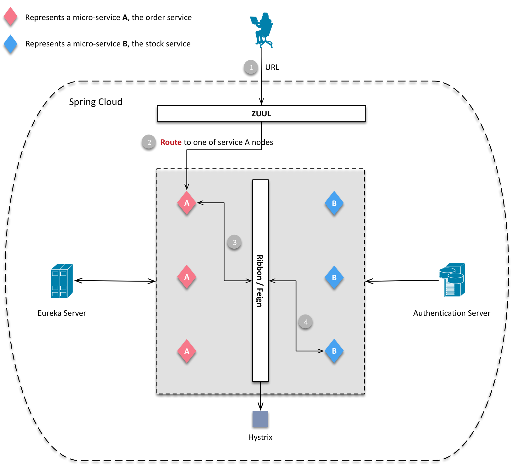
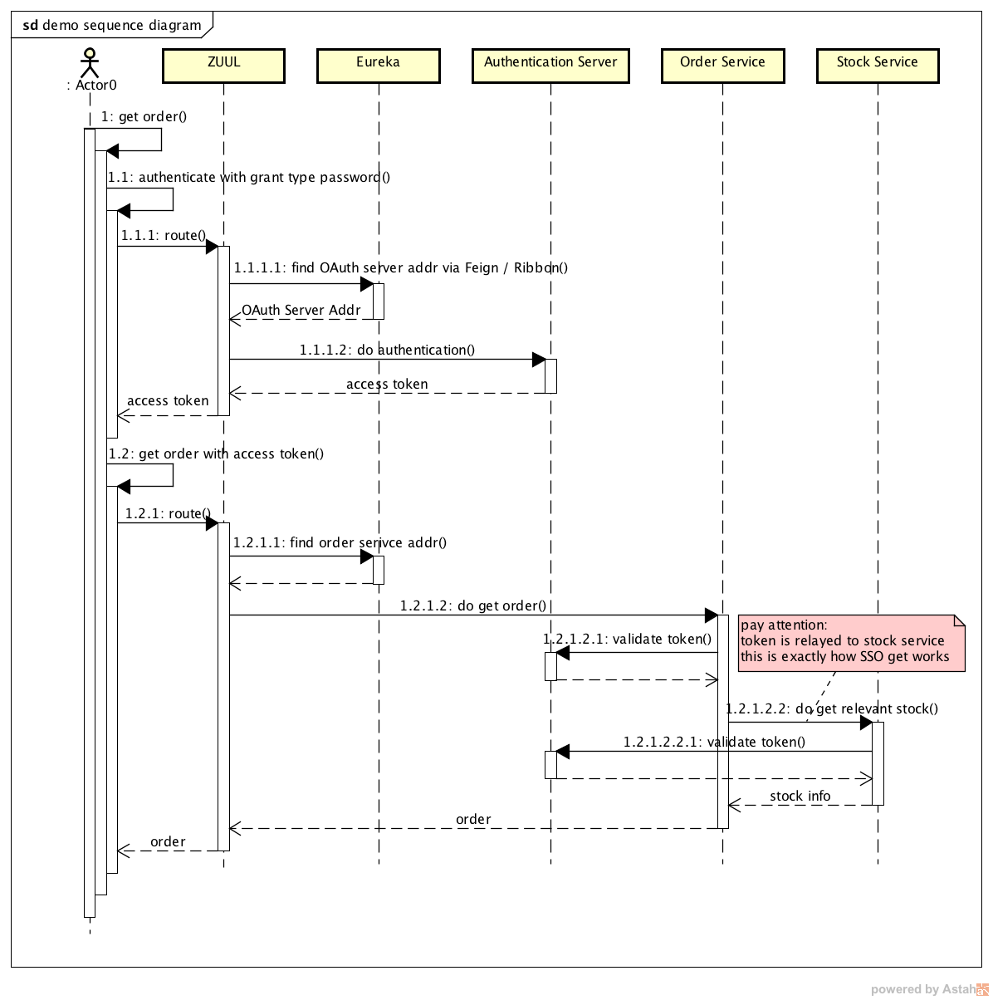

# Author

Shang Yang, contact me: comedshang@gmail.com / comedshang@163.com; 

welcome to my personal blog <a href="http://www.shangyang.me">www.shangyang.me</a>

# Preface

The scaffolds demo including the Spring OAuth framework ( Authentication server and Resource server ), Eureka (Service Register)、 Ribbon / Feign (Service Discover)、
ZUUL (Gate way)；

Two micro-services are provided for the demonstration, Order service and stock Service; the example of this demo is quite simple, the customer wants to make a deal, order is 
generated by remote call the Stock service; 

# The Framework

## framework sequence diagram

 

This is the high level sequence diagram introduces how those Spring Cloud modules communicate with each other, the customer wants to get some private resources, then all the relevant requests from 
the resources server must be authenticated; here, the resources servers are composed by the Order service and the Stock service; let's talk about some major steps below,

1. Step 3.1 Authenticates and authorizes
   of this step, the User must first get the authorization from the Authentication Server before he can touch those private resources; 
   after authenticated, the Authentication server response the access_token to the User

2. Step 3.2.1.1.1 validate token  
   Resource Servers will validate the _access\_token_ against the Authentication Server for make sure the current access token is valid

3. Step 3.2.1.1.1.2.1 token relay   
   Of this step, the Resource servers will relay their token to the next one, as this behavior as the SSO does. 

## the interactive diagram

This was the most simplest interactive diagram shows on a user how to get interact with the infrastructure to get the private resources,
it clears shows that, the user request is routed by the Gateway ZUUL to the destination micro-service A, then A uses the Ribbon or Feign to remote
call the remote service B, and also, all the inner request to the resource services A and B are protected by the Authentication server that's OAuth2  

## the sequence diagram 

 
The sequence diagram is made up focus on the business flow not the functional call, and it clearly shows how the micro-service Order interact with the Stock.

# the current version

the current version uses the mysql as the database to store the user and client authorization information including the user credentials, access\_token, refresh\_token, the client credentials and so on.... 

## how set up the database

create a schema named _myoauth_ on your local mysql server, all the database schema scripts are stored in sub project authentication-server, source path src/main/resources/schema.sql, 
what the only thing that you need to do is just create your schema, and tables will be automatically created since the Authentication Server get started.

And the database configuration is in _application.yml_ of sub project authentication-service.

# contact me

comedshang@gmail.com
comedshang@163.com

微信: comedsh

# 前言

一个完整的微服务架构设计框架代码，包含 Spring OAuth 框架（包含 Authentication Server and Resource Server），服务注册组件(Service Register)和服务发现组件(Service Discover)，以及网关(ZUUL)；本示例以
一个非常简单的例子进行描述，由 Order 微服务远程调用 Stock 微服务完成订单流程，整个过程通过 OAuth 进行验证，Order 和 Stock 微服务作为 Resource Service，调用它们的相关资源必须有足够的权限； 

## 设计

参考[The Framework](#the-framework)

# 数据库

当前版本，Client 和 用户的认证信息包括 access_token, refresh_token 等等都是存储在 mysql 数据库中的；下面将简要的描述如何搭建数据库

在本地数据库中创建名为 _myoauth_ 的 schema，数据库表的创建文件在子工程 authentication-server 的 source path src/main/resources/schema.sql 中；

# Reference

更多的详细介绍可参见我的私人博客 Spring Cloud 系列，http://www.shangyang.me/categories/Spring/Cloud/ 正不断更新中...