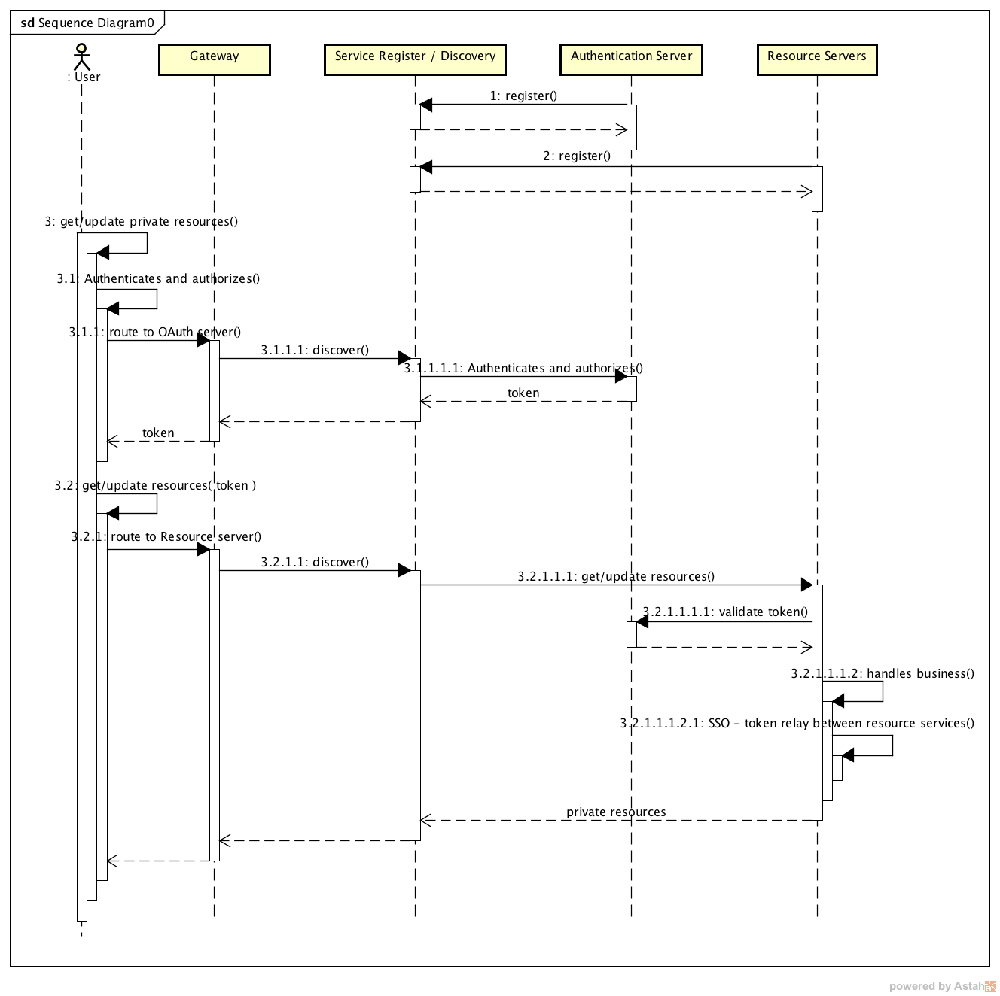

# Preface

The scaffolds demo including the Spring OAuth framework ( Authentication server and Resource server ), Eureka (Service Register)、 Ribbon / Feign (Service Discover)、
ZUUL (Gate way)；

Two micro-services are provided for the demonstration, Order service and stock Service; the example of this demo is quite simple, the customer wants to make a deal, order is 
generated by remote call the Stock service;

# The Framework

## sequence diagram

 

# contact me

comedshang@gmail.com

# 前言

一个完整的微服务架构设计框架代码，包含 Spring OAuth 框架（包含 Authentication Server and Resource Server），服务注册组件(Service Register)和服务发现组件(Service Discover)，以及网关(ZUUL)；本示例以
一个非常简单的例子进行描述，由 Order 微服务远程调用 Stock 微服务完成订单流程，整个过程通过 OAuth 进行验证，Order 和 Stock 微服务作为 Resource Service，调用它们的相关资源必须有足够的权限； 

## 设计

参考[The Framework](#the-framework)

# Reference

更多的详细介绍可参见我的私人博客 Spring Cloud 系列，http://www.shangyang.me/categories/Spring/Cloud/ 正不断更新中...